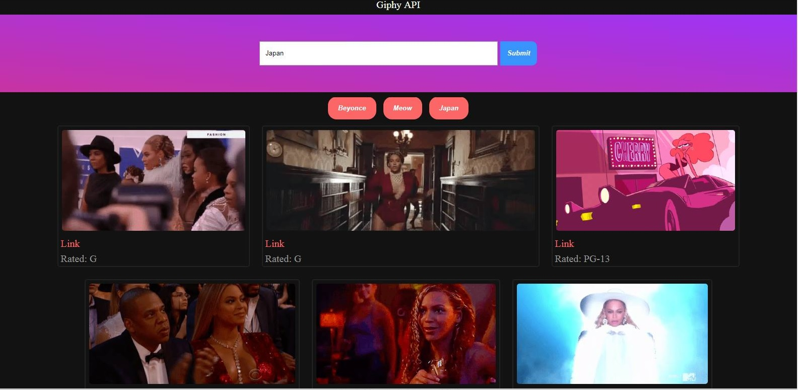

# GiphyAPI



 ```
* The user is able to search for gifs utilizing the Giphy API. 
* Each time a user enters a search term it creates a button with that term.
* From there the user can select that button and the page will populate random gifs from the triggered API call.
* When a user clicks on a gif it toggles between the still image and the animated gif.
* The user can also click the link to open a new tab to the Giphy page for that gif. 
 ```

### Preview Site

[Demo](https://rachelparris.github.io/GiphyAPI/)


### Built With

* JavaScript
* jQuery
* HTML
* CSS


### Contributers

* Rachel Parris
